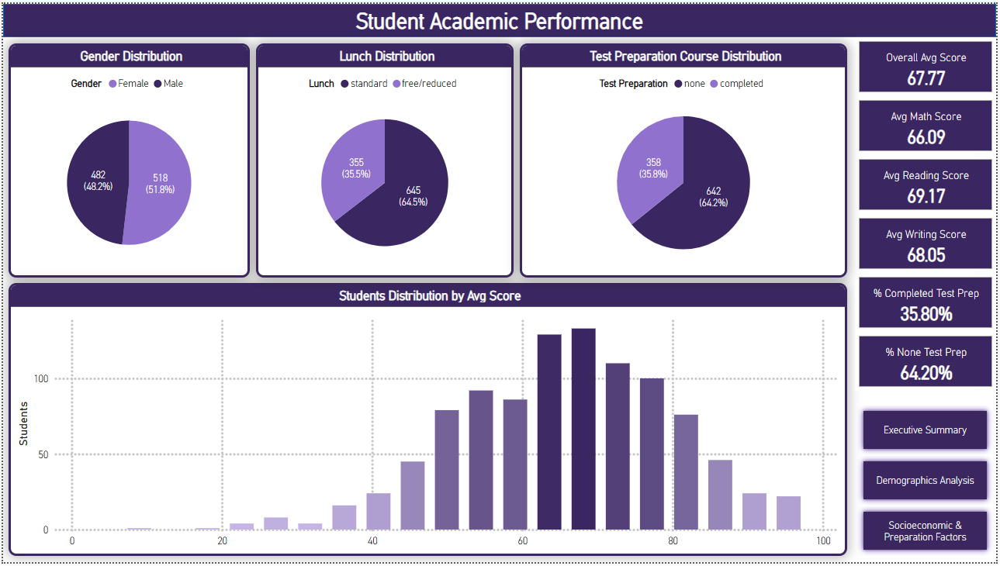
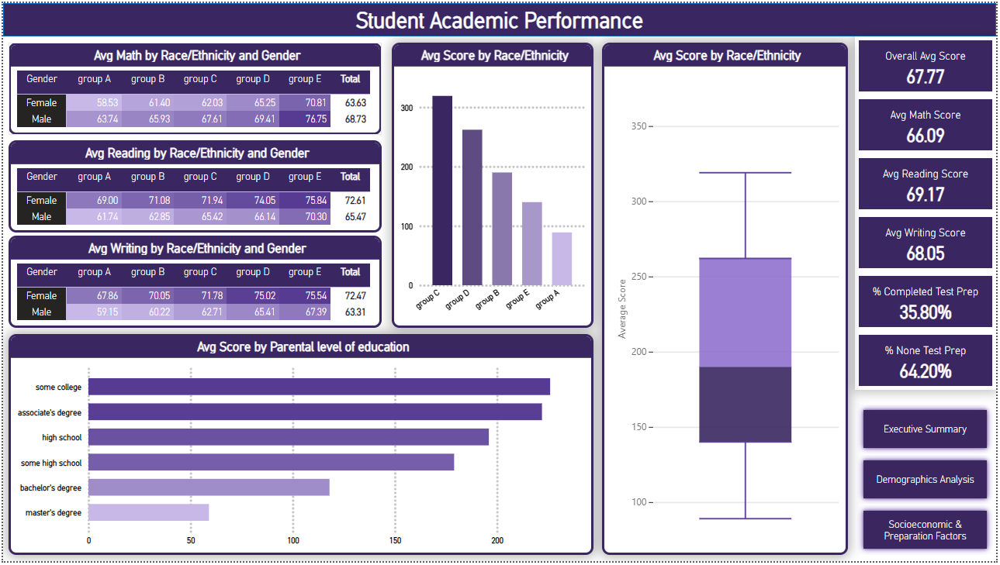

# Student Academic Performance Prediction

**Student Academic Performance Prediction** – A machine learning project that predicts students’ average exam performance based on demographic and educational factors. Includes a Jupyter notebook for data preprocessing and regression modeling (Linear, Polynomial, Random Forest, XGBoost) and a Power BI dashboard for interactive performance analysis.

---

## Table of Contents
- [Overview](#overview)  
- [Dataset](#dataset)  
- [Project Structure](#project-structure)  
- [Workflow](#workflow)  
- [Model Performance](#model-performance)  
- [Power BI Dashboard](#power-bi-dashboard)  
- [How to Run](#how-to-run)  
- [Future Improvements](#future-improvements)

---

## Overview
This project analyzes how demographic and educational features (gender, race/ethnicity, parental education, lunch type, and test preparation course) relate to students’ exam performance. The target is an aggregate performance score (average of math, reading, and writing scores). Multiple regression models were trained and evaluated; Linear Regression was selected as the preferred model for its combination of strong performance, stability, and interpretability.

---

## Dataset
- **Source:** `StudentsPerformance.csv`  
- **Key features:** `gender`, `race/ethnicity`, `parental level of education`, `lunch`, `test preparation course`, `math score`, `reading score`, `writing score`  
- **Target:** `average_score = (math + reading + writing) / 3`

---

## Workflow
1. **Data cleaning & EDA**
   - Inspected distributions, relationships and outliers
   - Verified missing values and handled if present
2. **Feature engineering**
   - Created `average_score` (target)
   - One-hot encoded categorical features
   - Scaled numerical features with `RobustScaler`
3. **Modeling**
   - Baseline and advanced regressors: Linear Regression, Polynomial Regression, Random Forest Regressor, XGBoost Regressor
   - Hyperparameter tuning with cross-validation (RandomizedSearchCV)
4. **Evaluation**
   - Metrics used: R² (coefficient of determination), MSE, RMSE
   - Cross-validation used to assess generalization

---

## Model Performance

| Model | R² (Train) | R² (Test) | RMSE (Train) | RMSE (Test) |
|--------|-------------|------------|---------------|--------------|
| **Linear Regression** | 0.9507 | 0.9548 | 7.2751 | 7.2399 |
| **Polynomial Regression** | 0.9520 | 0.9533 | 7.1761 | 7.3643 |
| **Random Forest (Tuned)** | 0.9662 | 0.9385 | 6.0232 | 8.4512 |
| **XGBoost (Tuned)** | 0.9579 | 0.9472 | 6.7247 | 7.8279 |

### Summary (key extracted results from notebook)
- **Linear Regression**  
  - **R²:** ≈ 0.95 (train & test)  
  - **RMSE:** ≈ 7.2  
  - Notes: Strong baseline performance, consistent train/test scores (low variance), easy to interpret coefficients.

- **Polynomial Regression**  
  - Slightly more complex; did not yield meaningful improvements over linear baseline in practice.

- **Random Forest (tuned)**  
  - **Best CV R²:** ≈ 0.936 (best cross-validated score reported)  
  - **Tuned CV RMSE (example):** ~6.02 (noted in tuning outputs)  
  - Notes: Competitive CV numbers but showed signs of variance/overfitting in some configurations; less interpretable.

- **XGBoost (tuned)**  
  - Tuned runs produced competitive CV results (RMSE seen in notebook ~6.7–7.8 depending on config)  
  - Notes: Improved with tuning but still offered a trade-off between slight metric gains and increased complexity/interpretability cost.

### Why Linear Regression was chosen
- Highest overall stability across folds and between train/test (R² ≈ 0.95 with balanced RMSE).
- Simpler model with direct, interpretable coefficients — valuable for educational domain insights.
- While Random Forest and XGBoost produced comparable cross-validated results in some runs, they introduced more variance and complexity; Linear Regression consistently generalized well on the test set.

---

## Power BI Dashboard
An interactive Power BI dashboard accompanies this analysis. It visualizes:
- Overall Summary

- Demographics Analysis

